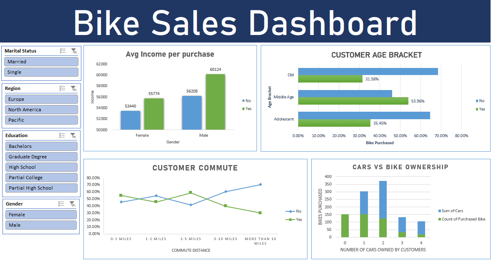

# Customer Purchase Patterns: An End-to-End Excel Dashboard Project

This project analyzes customer demographic data to uncover key behavioral and socioeconomic drivers behind bike purchases. Using an interactive Excel dashboard with dynamic PivotTables and slicers, it transforms raw customer records into actionable marketing and product insights to optimize sales strategy.

---

## Dashboard Preview

### 🎬 Interactive Demonstration

---

## Executive Summary

Understanding consumer demographics is vital for optimizing sales strategies and targeting high-conversion customer segments. This project cleans and analyzes a dataset of **1,000 customer records** containing attributes such as income, commute distance, age bracket, education, home ownership, and car counts. 

By building an interactive Excel dashboard driven by dynamic PivotTables and regional/demographic slicers, this project translates complex transactional data into actionable business recommendations for target marketing and product positioning.

---

## Key Analytical Insights

* **Target Age Segment:** **Middle-aged professionals** (ages 31–54) represent the bulk of sales volume, achieving the highest purchase conversion rate (**54.0%**) compared to Adolescent (**35.5%**) and Old (**31.6%**) cohorts.
* **Commute Sensitivity:** Conversion peaks for customers with short daily commutes. Customers living within **0–1 miles** (**54.6%** conversion) and **2–5 miles** (**58.6%** conversion) show strong intent, whereas long-distance commuters (**>10 miles**) drop off significantly to **29.7%**.
* **Vehicle Ownership vs. Micro-Mobility:** Households with **0 to 1 cars** convert at a rate of **~57–61%**. Once household car ownership reaches 2 or more, bike conversion declines rapidly (dropping to **36.3%** for 2-car households), indicating bikes act as primary micro-mobility tools rather than secondary recreation.
* **Income Threshold:** Higher average income correlates positively with bike purchasing across both genders. Male buyers average **$60,124** compared to male non-buyers at **$56,208**, while female buyers average **$55,774** vs. non-buyers at **$53,440**.

---

## Strategic Business Recommendations

1. **Focus Digital Ad Budget on Short-Commute Professionals:** Target geo-fenced digital advertisements toward middle-aged working professionals living within 5 miles of urban business districts, highlighting bikes as eco-friendly daily commuting alternatives.
2. **First-Time / Low-Car Household Bundles:** Create promotional starter bundles (including helmets, locks, and commuter panniers) aimed at single/low-vehicle households to capitalize on high conversion rates in 0–1 car segments.
3. **Regional Messaging Alignment:** Utilize slice-and-dice capability across regions (Europe, North America, Pacific) to tailor messaging based on local infrastructure and distance habits.

---

## Data Pipeline & Technical Features

* **Data Cleaning & Preprocessing:** Executed data transformation rules in Excel, including standardizing text fields, handling null values, and creating categorized helper columns (e.g., `Age Brackets` grouping).
* **PivotTables & Aggregations:** Aggregated raw data across multi-dimensional criteria including average income, age distributions, commute bins, and car counts cross-tabulated with purchase status (`Purchased Bike`).
* **Interactive UI / Dashboard:** Designed a clean 2x2 grid layout integrated with unified color codes, custom slicers (**Marital Status**, **Region**, **Education**, **Gender**), and removed default field buttons to ensure executive-level readability.

---
